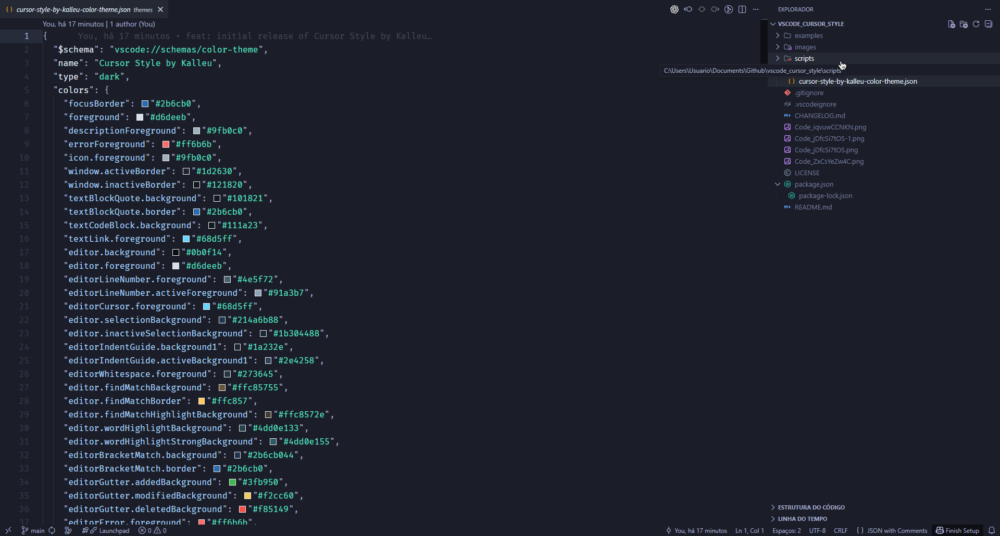

# Cursor Style by Kalleu

Tema escuro moderno para VS Code, com visual clean e foco em produtividade, legibilidade e baixa fadiga visual durante longas sessões de código.

## ✨ Visão geral

- **Nome da extensão:** `Cursor Style by Kalleu`
- **Publisher:** `Kalloyer`
- **Tipo de tema:** `dark` (`vs-dark`)
- **Objetivo:** oferecer contraste equilibrado, sintaxe clara e consistência visual entre editor, sidebar e terminal

## 🎯 Destaques do tema

- Base escura profunda para reduzir brilho excessivo
- Acentos frios (azul/ciano) para foco e navegação
- Sintaxe equilibrada para leitura rápida
  - **Keywords** em tom quente para contraste
  - **Strings** em verde suave
  - **Tipos/Funções** em tons de ciano/verde
- Consistência visual entre:
  - Editor
  - Sidebar
  - Explorer
  - Status Bar
  - Terminal
- Suporte a `semanticTokenColors`

## 🖼️ Screenshots




## 📦 Instalação

### Instalar pelo Marketplace

Extensão publicada no VS Code Marketplace:

- **ID:** `Kalloyer.cursor-style-by-kalleu`
- **Versão publicada:** `0.0.3`

Link:
`https://marketplace.visualstudio.com/items?itemName=Kalloyer.cursor-style-by-kalleu`

---

### Instalação local (`.vsix`)

1. Na raiz do projeto, execute:
```bash
npm install
npm run package
````

2. No VS Code:

   * Abra a Command Palette (`Ctrl+Shift+P`)
   * Execute `Extensions: Install from VSIX...`
   * Selecione o arquivo `.vsix` gerado

## 🧪 Como testar no VS Code

1. Abra a pasta `cursor-style-by-kalleu` no VS Code
2. Pressione `F5` para iniciar um **Extension Development Host**
3. No host, abra `Preferences: Color Theme`
4. Selecione **Cursor Style by Kalleu**

## 🔄 Converter `settings.json` para o tema

O projeto inclui um script para converter customizações do seu `settings.json` para o arquivo do tema.

### O que o script converte

* `workbench.colorCustomizations` → `themes/.../colors`
* `editor.tokenColorCustomizations.textMateRules` → `themes/.../tokenColors`
* `editor.semanticTokenColorCustomizations` → `themes/.../semanticTokenColors`

### Uso com Python

```bash
python scripts/convert_settings_to_theme.py --settings /caminho/para/settings.json
```

### Uso via npm script

```bash
npm run convert-theme -- --settings /caminho/para/settings.json
```

### Segurança e backup

Antes de sobrescrever o tema, o script cria um backup com timestamp.

Exemplo:
`cursor-style-by-kalleu-color-theme.json.bak.20260220-145500`

> Para desativar backup, use `--no-backup` (se aplicável na sua versão do script).

## 🚀 Bootstrap rápido

Para preparar o ambiente local rapidamente:

```bash
bash scripts/setup.sh
```

Esse script:

* cria `.venv`
* instala dependências Node
* valida o JSON do tema
* roda conversão de exemplo
* gera o pacote `.vsix`

> No Windows, use **Git Bash** ou **WSL** para executar o `setup.sh`.

## 🧱 Estrutura do projeto

```text
cursor-style-by-kalleu/
├─ themes/
│  └─ cursor-style-by-kalleu-color-theme.json
├─ scripts/
│  ├─ convert_settings_to_theme.py
│  └─ setup.sh
├─ examples/
│  └─ settings.sample.json
├─ images/
│  └─ icon.png
├─ package.json
├─ README.md
├─ CHANGELOG.md
├─ LICENSE
├─ .gitignore
└─ .vscodeignore
```

## ⚙️ Recommended settings (opcional)

Essas configurações não fazem parte do tema, mas combinam bem com a proposta visual:

```json
{
  "editor.fontFamily": "JetBrains Mono, Fira Code, Consolas, monospace",
  "editor.fontLigatures": true,
  "editor.minimap.enabled": false,
  "editor.cursorSmoothCaretAnimation": "on",
  "editor.smoothScrolling": true,
  "terminal.integrated.fontFamily": "JetBrains Mono, Fira Code, Consolas, monospace",
  "workbench.list.smoothScrolling": true
}
```

## 📌 Status do projeto

* ✅ Extensão criada e estruturada para Marketplace
* ✅ Tema dark implementado (`vs-dark`)
* ✅ `tokenColors` e `semanticTokenColors` configurados
* ✅ Script de conversão `settings.json` → tema
* ✅ Script de bootstrap (`setup.sh`)
* ✅ Publicado no Marketplace (`0.0.3`)